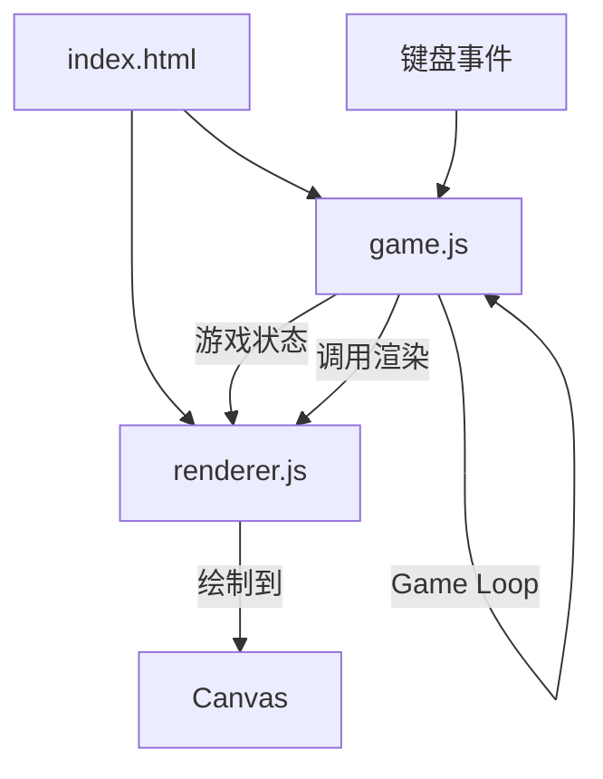
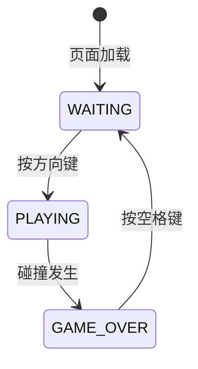
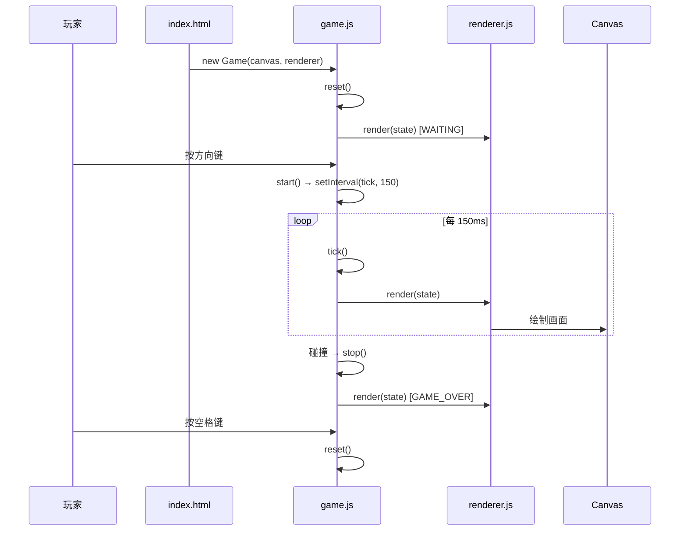

# 技术设计文档：贪吃蛇游戏（Snake Game）

## 概述（Overview）

本设计文档描述了一个基于浏览器的经典贪吃蛇游戏的技术实现方案。游戏使用 HTML5 Canvas 和原生 JavaScript 构建，无需任何第三方框架或库。

项目为全新空工程，最终交付物包括：
- `index.html` — 页面结构与样式
- `game.js` — 游戏核心逻辑（状态管理、碰撞检测、游戏循环）
- `renderer.js` — 渲染模块（Canvas 绘制）

游戏核心流程：页面加载 → 初始化游戏状态 → 等待玩家按键开始 → 游戏循环（移动蛇、检测碰撞、更新分数、渲染画面）→ 游戏结束 → 等待重新开始。

## 架构（Architecture）

采用简单的模块化架构，将游戏逻辑与渲染职责分离：



### 状态机

游戏有三个状态，通过玩家操作进行切换：



- **WAITING** — 初始/重置状态，显示提示文字，等待玩家按方向键开始
- **PLAYING** — 游戏进行中，Game Loop 运行，蛇持续移动
- **GAME_OVER** — 游戏结束，显示最终分数和重新开始提示

### 游戏循环

使用 `setInterval` 以 150ms 间隔驱动游戏循环，每个 tick 执行：
1. 处理方向输入
2. 移动蛇（计算新头部位置）
3. 检测碰撞（墙壁 + 自身）
4. 检测食物碰撞
5. 更新状态（分数、蛇身长度、食物位置）
6. 调用渲染器重绘画面

## 组件与接口（Components and Interfaces）

### game.js — 游戏核心模块

负责所有游戏状态管理和逻辑处理。

```javascript
/**
 * 游戏状态枚举
 */
const GameState = {
  WAITING: 'waiting',
  PLAYING: 'playing',
  GAME_OVER: 'game_over'
};

/**
 * 方向枚举及向量映射
 */
const Direction = {
  UP: { x: 0, y: -1 },
  DOWN: { x: 0, y: 1 },
  LEFT: { x: -1, y: 0 },
  RIGHT: { x: 1, y: 0 }
};

/**
 * 游戏核心类
 */
class Game {
  constructor(canvas, renderer)

  /** 初始化/重置游戏状态 */
  reset()

  /** 启动游戏循环 */
  start()

  /** 游戏主循环 tick */
  tick()

  /** 移动蛇：计算新头部，更新蛇身数组 */
  moveSnake(): { x: number, y: number }

  /** 改变方向（含反向校验） */
  changeDirection(newDirection): boolean

  /** 检测墙壁碰撞 */
  checkWallCollision(head): boolean

  /** 检测自身碰撞 */
  checkSelfCollision(head): boolean

  /** 检测食物碰撞 */
  checkFoodCollision(head): boolean

  /** 在未被蛇占据的随机位置生成食物 */
  spawnFood(): { x: number, y: number }

  /** 处理键盘事件 */
  handleKeydown(event)

  /** 停止游戏循环 */
  stop()
}
```

### renderer.js — 渲染模块

负责将游戏状态绘制到 Canvas 上。

```javascript
class Renderer {
  constructor(canvas, gridSize)

  /** 清除画布 */
  clear()

  /** 绘制网格边界线 */
  drawGrid()

  /** 绘制蛇（头部与身体使用不同颜色） */
  drawSnake(snake)

  /** 绘制食物 */
  drawFood(food)

  /** 绘制分数 */
  drawScore(score)

  /** 绘制提示文字（开始提示/游戏结束） */
  drawMessage(text)

  /** 完整渲染一帧 */
  render(gameState)
}
```

### index.html — 页面入口

- 包含 Canvas 元素（400×400）
- 引入 `renderer.js` 和 `game.js`
- 页面居中布局，深色背景
- 显示标题"贪吃蛇"和操作说明

### 模块间交互



## 数据模型（Data Models）

### 坐标点（Point）

```javascript
// 网格坐标，x 和 y 均为 0 到 (GRID_COUNT - 1) 的整数
{ x: number, y: number }
```

### 游戏状态（GameState Object）

```javascript
{
  state: 'waiting' | 'playing' | 'game_over',  // 当前游戏状态
  snake: [                                       // 蛇身数组，索引 0 为头部
    { x: number, y: number },
    // ...
  ],
  direction: { x: number, y: number },           // 当前移动方向向量
  nextDirection: { x: number, y: number },        // 下一 tick 生效的方向（防止同一 tick 多次转向）
  food: { x: number, y: number },                // 食物位置
  score: number,                                  // 当前分数
}
```

### 常量配置

```javascript
const CONFIG = {
  CANVAS_SIZE: 400,       // 画布尺寸（像素）
  GRID_SIZE: 20,          // 网格单元尺寸（像素）
  GRID_COUNT: 20,         // 网格数量（400 / 20）
  TICK_INTERVAL: 150,     // 游戏循环间隔（毫秒）
  INITIAL_LENGTH: 3,      // 蛇的初始长度
  SCORE_PER_FOOD: 10,     // 每个食物的分数
  COLORS: {
    BACKGROUND: '#1a1a2e',    // 画布背景色
    GRID_LINE: '#16213e',     // 网格线颜色
    SNAKE_HEAD: '#e94560',    // 蛇头颜色
    SNAKE_BODY: '#0f3460',    // 蛇身颜色
    FOOD: '#e94560',          // 食物颜色
    TEXT: '#eee',             // 文字颜色
  }
};
```

### 蛇的移动算法

每个 tick：
1. 根据 `direction` 计算新头部坐标：`newHead = { x: snake[0].x + direction.x, y: snake[0].y + direction.y }`
2. 将 `newHead` 插入 `snake` 数组头部
3. 如果未吃到食物，移除 `snake` 数组尾部元素（保持长度不变）
4. 如果吃到食物，不移除尾部（蛇变长），分数 +10，生成新食物

### 食物生成算法

1. 收集所有被蛇占据的网格坐标
2. 从所有未被占据的网格位置中随机选择一个
3. 如果没有空闲位置（蛇占满整个网格），不生成食物（理论上的极端情况）


## 正确性属性（Correctness Properties）

*属性（Property）是指在系统所有有效执行中都应保持为真的特征或行为——本质上是对系统应做什么的形式化陈述。属性是人类可读规范与机器可验证正确性保证之间的桥梁。*

### Property 1: 方向键映射正确

*For any* 有效方向键输入（上、下、左、右），调用 `changeDirection` 后，游戏的 `nextDirection` 应等于该方向键对应的方向向量。

**Validates: Requirements 2.1, 2.2, 2.3, 2.4**

### Property 2: 反向输入被忽略

*For any* 当前移动方向，当尝试设置其 180 度反方向时，`changeDirection` 应返回 false，且 `nextDirection` 保持不变。

**Validates: Requirements 2.5**

### Property 3: 蛇沿方向移动一格

*For any* 有效的蛇位置和移动方向，调用 `moveSnake` 后，新的蛇头坐标应等于原蛇头坐标加上方向向量（即 `newHead.x === oldHead.x + direction.x` 且 `newHead.y === oldHead.y + direction.y`）。

**Validates: Requirements 2.6**

### Property 4: 吃食物后分数增加且蛇变长

*For any* 游戏状态，当蛇头移动到食物所在位置时，分数应增加 10，且蛇的长度应增加 1。

**Validates: Requirements 3.1, 3.2**

### Property 5: 食物生成在有效且未被占据的位置

*For any* 蛇的状态，`spawnFood` 生成的食物坐标应满足：x 和 y 均在 `[0, GRID_COUNT - 1]` 范围内，且该坐标不与蛇身任何部分重叠。

**Validates: Requirements 1.3, 3.3**

### Property 6: 墙壁碰撞检测

*For any* 坐标点，`checkWallCollision` 返回 true 当且仅当该坐标的 x 或 y 超出 `[0, GRID_COUNT - 1]` 范围。

**Validates: Requirements 4.1**

### Property 7: 自身碰撞检测

*For any* 蛇身数组和头部坐标，`checkSelfCollision` 返回 true 当且仅当头部坐标与蛇身（不含头部）中的某个坐标相同。

**Validates: Requirements 4.2**

### Property 8: 碰撞后游戏状态转换

*For any* 处于 PLAYING 状态的游戏，当 tick 中检测到墙壁碰撞或自身碰撞时，游戏状态应变为 GAME_OVER。

**Validates: Requirements 4.4**

### Property 9: 重置恢复初始状态

*For any* 游戏状态（无论当前分数、蛇的长度和位置如何），调用 `reset` 后，蛇的长度应为 3、分数应为 0、游戏状态应为 WAITING、食物应在有效位置。

**Validates: Requirements 5.2**

## 错误处理（Error Handling）

### 输入错误

| 场景 | 处理方式 |
|------|---------|
| 非方向键/空格键输入 | 忽略，不做任何处理 |
| 游戏未开始时按空格键 | 忽略 |
| 游戏进行中按空格键 | 忽略 |
| 快速连续按键 | 使用 `nextDirection` 缓冲，每个 tick 只处理一次方向变更 |

### 边界情况

| 场景 | 处理方式 |
|------|---------|
| 蛇占满整个网格 | `spawnFood` 不生成新食物（极端情况，实际几乎不会发生） |
| 页面失去焦点 | Game Loop 继续运行（浏览器默认行为，`setInterval` 在后台可能降频） |
| Canvas 不支持 | 现代浏览器均支持，不做特殊降级处理 |

## 测试策略（Testing Strategy）

### 测试框架

- **单元测试与属性测试**: 使用 [Jest](https://jestjs.io/) 作为测试运行器
- **属性测试库**: 使用 [fast-check](https://github.com/dubzzz/fast-check) 进行属性测试（Property-Based Testing）
- 由于项目使用原生 JavaScript，测试中需要 mock Canvas API（`getContext('2d')`）

### 双重测试方法

**单元测试**（验证具体示例和边界情况）：
- 游戏初始化后 Canvas 尺寸为 400×400
- 初始蛇长度为 3，位于画布中央
- 初始分数为 0
- 游戏结束后按空格键重置所有状态
- 蛇占满大部分网格时食物仍能正确生成

**属性测试**（验证通用属性，每个属性至少运行 100 次迭代）：

每个属性测试必须用注释标注对应的设计属性：

- **Feature: snake-game, Property 1: 方向键映射正确** — 生成随机有效方向，验证映射
- **Feature: snake-game, Property 2: 反向输入被忽略** — 生成随机方向对，验证反向被拒绝
- **Feature: snake-game, Property 3: 蛇沿方向移动一格** — 生成随机蛇位置和方向，验证移动结果
- **Feature: snake-game, Property 4: 吃食物后分数增加且蛇变长** — 生成随机游戏状态，模拟吃食物
- **Feature: snake-game, Property 5: 食物生成在有效且未被占据的位置** — 生成随机蛇身，验证食物位置
- **Feature: snake-game, Property 6: 墙壁碰撞检测** — 生成随机坐标，验证碰撞判定
- **Feature: snake-game, Property 7: 自身碰撞检测** — 生成随机蛇身和头部位置，验证碰撞判定
- **Feature: snake-game, Property 8: 碰撞后游戏状态转换** — 生成碰撞场景，验证状态变为 GAME_OVER
- **Feature: snake-game, Property 9: 重置恢复初始状态** — 生成随机游戏状态，调用 reset，验证初始条件

### 测试文件结构

```
tests/
  game.test.js        # Game 类的单元测试和属性测试
  renderer.test.js    # Renderer 类的单元测试（mock Canvas API）
```
